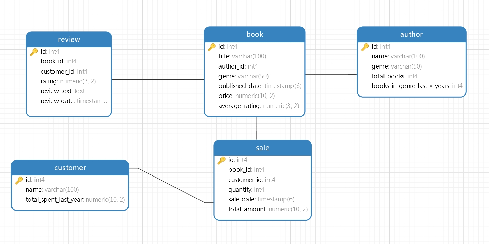

# SENG8071 Final

## Group 4

## Contribution Table
|     ID      |      Name     |      Responsibility     |
| ------------- |---------------|---------------|
| 8838253       | Vaishnavi Kotakal   | CRUD functions for every table   |
| 8905625         | Ravi Teja Matta  | unit tests for CRUD operation   |
| 8882871   | Jiehui Wang  | integration tests for CRUD operation & diagram   |

## Working database with tables
```
// Author table
import { Entity, PrimaryGeneratedColumn, Column } from "typeorm";

@Entity()
export class Author {
  @PrimaryGeneratedColumn()
  id!: number;

  @Column({ length: 100 })
  name!: string;

  @Column({ length: 50 })
  genre!: string;

  @Column()
  total_books!: number;

  @Column()
  books_in_genre_last_x_years!: number;
}
```

```
// Book table
import { Entity, PrimaryGeneratedColumn, Column, ManyToOne } from "typeorm";
import { Author } from "./Author";

@Entity()
export class Book {
  @PrimaryGeneratedColumn()
  id!: number;

  @Column({ length: 100 })
  title!: string;

  @Column()
  author_id!: number;

  @Column({ length: 50 })
  genre!: string;

  @Column()
  published_date!: Date;

  @Column("decimal", { precision: 10, scale: 2 })
  price!: number;

  @Column("decimal", { precision: 3, scale: 2 })
  average_rating!: number;
}
```

```
// Customer table
import { Entity, PrimaryGeneratedColumn, Column } from "typeorm";

@Entity()
export class Customer {
  @PrimaryGeneratedColumn()
  id!: number;

  @Column({ length: 100 })
  name!: string;

  @Column("decimal", { precision: 10, scale: 2 })
  total_spent_last_year!: number;
}
```

```
// Review table
import { Entity, PrimaryGeneratedColumn, Column, ManyToOne } from "typeorm";
import { Book } from "./Book";
import { Customer } from "./Customer";

@Entity()
export class Review {
  @PrimaryGeneratedColumn()
  id!: number;

  @Column()
  book_id!: number;

  @Column()
  customer_id!: number;

  @Column("decimal", { precision: 3, scale: 2 })
  rating!: number;

  @Column("text")
  review_text!: string;

  @Column()
  review_date!: Date;
}
```

```
// Sale table
import { Entity, PrimaryGeneratedColumn, Column, ManyToOne } from "typeorm";
import { Book } from "./Book";
import { Customer } from "./Customer";

@Entity()
export class Sale {
  @PrimaryGeneratedColumn()
  id!: number;

  @Column()
  book_id!: number;

  @Column()
  customer_id!: number;

  @Column()
  quantity!: number;

  @Column()
  sale_date!: Date;

  @Column("decimal", { precision: 10, scale: 2 })
  total_amount!: number;
}
```
## Implement CRUD functions to interact with table
```
import express from 'express';
import { createConnection, getRepository } from 'typeorm';
import { Author } from './entity/Author';
import path from 'path';

const app = express();
app.use(express.json());
app.use(express.static(path.join(__dirname, '../public')));

createConnection().then(() => {
  console.log('Connected to the database');

  // CRUD API Routes
  // create
  app.post('/authors', async (req, res) => {
    try {
      const authorRepository = getRepository(Author);
      const author = authorRepository.create(req.body);
      const result = await authorRepository.save(author);
      res.status(201).json(result);
    } catch (error) {
      res.status(400).json({ message: 'Error creating author', error });
    }
  });

  //find one(read)
  app.get('/authors/:id', async (req, res) => {
    try {
      const authorRepository = getRepository(Author);
      const author = await authorRepository.findOne({
        where: { id: parseInt(req.params.id, 10) }
      });
      if (author) {
        res.status(200).json(author);
      } else {
        res.status(404).json({ message: 'Author not found' });
      }
    } catch (error) {
      res.status(400).json({ message: 'Error fetching author', error });
    }
  });
  
  //find list(read all)
  app.get('/authors', async (req, res) => {
    try {
      const authorRepository = getRepository(Author);
      const authors = await authorRepository.find();
      res.status(200).json(authors);
    } catch (error) {
      res.status(400).json({ message: 'Error fetching authors', error });
    }
  });
  
  //update
  app.put('/authors/:id', async (req, res) => {
    try {
      const authorRepository = getRepository(Author);
      const author = await authorRepository.findOne({
        where: { id: parseInt(req.params.id, 10) }
      });
      if (author) {
        authorRepository.merge(author, req.body);
        const result = await authorRepository.save(author);
        res.status(200).json(result);
      } else {
        res.status(404).json({ message: 'Author not found' });
      }
    } catch (error) {
      res.status(400).json({ message: 'Error updating author', error });
    }
  });

  //delete
  app.delete('/authors/:id', async (req, res) => {
    try {
      const authorRepository = getRepository(Author);
      const result = await authorRepository.delete({
        id: parseInt(req.params.id, 10)
      });
      if (result.affected) {
        res.status(204).send();
      } else {
        res.status(404).json({ message: 'Author not found' });
      }
    } catch (error) {
      res.status(400).json({ message: 'Error deleting author', error });
    }
  });
  
  
  const PORT = process.env.PORT || 3000;
  app.listen(PORT, () => {
    console.log(`Server is running on port ${PORT}`);
  });
});

```

## Write unit tests that covers the CRUD operations
```
import "reflect-metadata";
import { createConnection, getConnection, getRepository } from "typeorm";
import { Author } from "../entity/Author";
import { Book } from "../entity/Book";
import { Customer } from "../entity/Customer";
import { Review } from "../entity/Review";
import { Sale } from "../entity/Sale";

describe("Database Schema", () => {


  beforeAll(async () => {
    const authorRepository = getRepository(Author);
    await authorRepository.clear();
    const bookRepository = getRepository(Book);
    await bookRepository.clear();
    const customerRepository = getRepository(Customer);
    await customerRepository.clear();
    const reviewRepository = getRepository(Review);
    await reviewRepository.clear();
  });


  //Create
  test("Create Author", async () => {
    const authorRepository = getRepository(Author);

    // Create
    const author = new Author();
    author.name = "J.K. Rowling";
    author.genre = "Fantasy";
    author.total_books = 15;
    author.books_in_genre_last_x_years = 5;
    await authorRepository.save(author);

    // Read
    const savedAuthor = await authorRepository.findOne({ where: { name: "J.K. Rowling" } });
    expect(savedAuthor).toBeDefined();
    expect(savedAuthor?.name).toBe("J.K. Rowling");
    expect(savedAuthor?.genre).toBe("Fantasy");
    expect(savedAuthor?.total_books).toBe(15);
    expect(savedAuthor?.books_in_genre_last_x_years).toBe(5);
  });

  //Read
  test("Read Book", async () => {
    const bookRepository = getRepository(Book);

    // Create
    const book = new Book();
    book.title = "book1";
    book.author_id = 1;
    book.genre = "test";
    book.price = 99;
    book.average_rating = 1;
    book.published_date = new Date();
    await bookRepository.save(book);

    // Read
    const savedBook = await bookRepository.findOne({ where: { title: "book1" } });
    expect(savedBook).toBeDefined();
    expect(savedBook?.title).toBe("book1");
    expect(savedBook?.genre).toBe("test");
  });

  //Update
  test("Update Customer", async () => {
    const customerRepository = getRepository(Customer);

    // Create
    const customer = new Customer();
    customer.name = "test1";
    customer.total_spent_last_year = 1;
    await customerRepository.save(customer);

    // Update
    let savedCustomer = await customerRepository.findOne({ where: { name: "test1" } });
    if (savedCustomer) {
      savedCustomer.name = "test2";
      await customerRepository.save(savedCustomer);
    }

    // Read Updated
    savedCustomer = await customerRepository.findOne({ where: { name: "test2" } });
    expect(savedCustomer).toBeDefined();
    expect(savedCustomer?.name).toBe("test2");
  });

  //Delete
  test("Delete Review", async () => {
    const reviewRepository = getRepository(Review);

    // Create
    const review = new Review();
    review.book_id = 1;
    review.customer_id = 1;
    review.rating = 1;
    review.review_text = "text";
    review.review_date = new Date();
    await reviewRepository.save(review);

    // Delete
    let savedReview = await reviewRepository.findOne({ where: { review_text: "text" } });
    if (savedReview) {
      await reviewRepository.remove(savedReview);
    }

    // Read Deleted
    savedReview = await reviewRepository.findOne({ where: { review_text: "text" } });
    expect(savedReview).toBeNull();
  });
});

```

## Write integration tests that covers the CRUD operations
```
import { getRepository } from "typeorm";
import { Author } from "../entity/Author";

describe("Author Entity Integration Tests", () => {

    beforeAll(async () => {
        const authorRepository = getRepository(Author);
        await authorRepository.clear();
      });

  test("Create Author", async () => {
    const authorRepository = getRepository(Author);

    // Create
    const author = new Author();
    author.name = "J.K. Rowling";
    author.genre = "Fantasy";
    author.total_books = 15;
    author.books_in_genre_last_x_years = 5;
    await authorRepository.save(author);

    // Read
    const savedAuthor = await authorRepository.findOne({ where: { name: "J.K. Rowling" } });
    expect(savedAuthor).toBeDefined();
    expect(savedAuthor?.name).toBe("J.K. Rowling");
    expect(savedAuthor?.genre).toBe("Fantasy");
    expect(savedAuthor?.total_books).toBe(15);
    expect(savedAuthor?.books_in_genre_last_x_years).toBe(5);
  });

  test("Read Author", async () => {
    const authorRepository = getRepository(Author);

    // Create
    const author = new Author();
    author.name = "George R.R. Martin";
    author.genre = "Fantasy";
    author.total_books = 10;
    author.books_in_genre_last_x_years = 3;
    await authorRepository.save(author);

    // Read
    const savedAuthor = await authorRepository.findOne({ where: { name: "George R.R. Martin" } });
    expect(savedAuthor).toBeDefined();
    expect(savedAuthor?.name).toBe("George R.R. Martin");
    expect(savedAuthor?.genre).toBe("Fantasy");
    expect(savedAuthor?.total_books).toBe(10);
    expect(savedAuthor?.books_in_genre_last_x_years).toBe(3);
  });

  test("Update Author", async () => {
    const authorRepository = getRepository(Author);

    // Create
    const author = new Author();
    author.name = "testupdate";
    author.genre = "Fantasy";
    author.total_books = 10;
    author.books_in_genre_last_x_years = 3;
    await authorRepository.save(author);

    // Update
    let savedAuthor = await authorRepository.findOne({ where: { name: "testupdate" } });
    if (savedAuthor) {
      savedAuthor.total_books = 12;
      await authorRepository.save(savedAuthor);
    }

    // Read Updated
    savedAuthor = await authorRepository.findOne({ where: { name: "testupdate" } });
    expect(savedAuthor).toBeDefined();
    expect(savedAuthor?.total_books).toBe(12);
  });

  test("Delete Author", async () => {
    const authorRepository = getRepository(Author);

    // Create
    const author = new Author();
    author.name = "J.R.R. Tolkien";
    author.genre = "Fantasy";
    author.total_books = 25;
    author.books_in_genre_last_x_years = 8;
    await authorRepository.save(author);

    // Delete
    let savedAuthor = await authorRepository.findOne({ where: { name: "J.R.R. Tolkien" } });
    if (savedAuthor) {
      await authorRepository.remove(savedAuthor);
    }

    // Read Deleted
    savedAuthor = await authorRepository.findOne({ where: { name: "J.R.R. Tolkien" } });
    expect(savedAuthor).toBeNull();
  });
});

```
## Create a migration so that there is at least 3 rows of data in each table.
```
import { MigrationInterface, QueryRunner } from "typeorm";

export class SeedInitialData1680000000000 implements MigrationInterface {
    public async up(queryRunner: QueryRunner): Promise<void> {
        await queryRunner.query(`
            INSERT INTO Authors (id, name, genre, total_books, books_in_genre_last_x_years) VALUES
            (1, 'Author One', 'Fiction', 10, 3),
            (2, 'Author Two', 'Non-Fiction', 8, 2),
            (3, 'Author Three', 'Science Fiction', 15, 5);

            INSERT INTO Books (id, title, author_id, genre, published_date, price, average_rating) VALUES
            (1, 'Book One', 1, 'Fiction', '2023-01-01', 9.99, 4.5),
            (2, 'Book Two', 2, 'Non-Fiction', '2023-02-01', 12.99, 4.0),
            (3, 'Book Three', 3, 'Science Fiction', '2023-03-01', 14.99, 4.8);

            INSERT INTO Customers (id, name, total_spent_last_year) VALUES
            (1, 'Customer One', 100.00),
            (2, 'Customer Two', 150.00),
            (3, 'Customer Three', 200.00);

            INSERT INTO Reviews (id, book_id, customer_id, rating, review_text, review_date) VALUES
            (1, 1, 1, 4.5, 'Great book!', '2023-04-01'),
            (2, 2, 2, 4.0, 'Very informative.', '2023-05-01'),
            (3, 3, 3, 4.8, 'Excellent read.', '2023-06-01');

            INSERT INTO Sales (id, book_id, customer_id, quantity, sale_date, total_amount) VALUES
            (1, 1, 1, 1, '2023-07-01', 9.99),
            (2, 2, 2, 2, '2023-07-02', 25.98),
            (3, 3, 3, 3, '2023-07-03', 44.97);
        `);
    }

    public async down(queryRunner: QueryRunner): Promise<void> {
        await queryRunner.query(`
            DELETE FROM Sales WHERE id IN (1, 2, 3);
            DELETE FROM Reviews WHERE id IN (1, 2, 3);
            DELETE FROM Customers WHERE id IN (1, 2, 3);
            DELETE FROM Books WHERE id IN (1, 2, 3);
            DELETE FROM Authors WHERE id IN (1, 2, 3);
        `);
    }
}
```

## Entity Relations diagram

